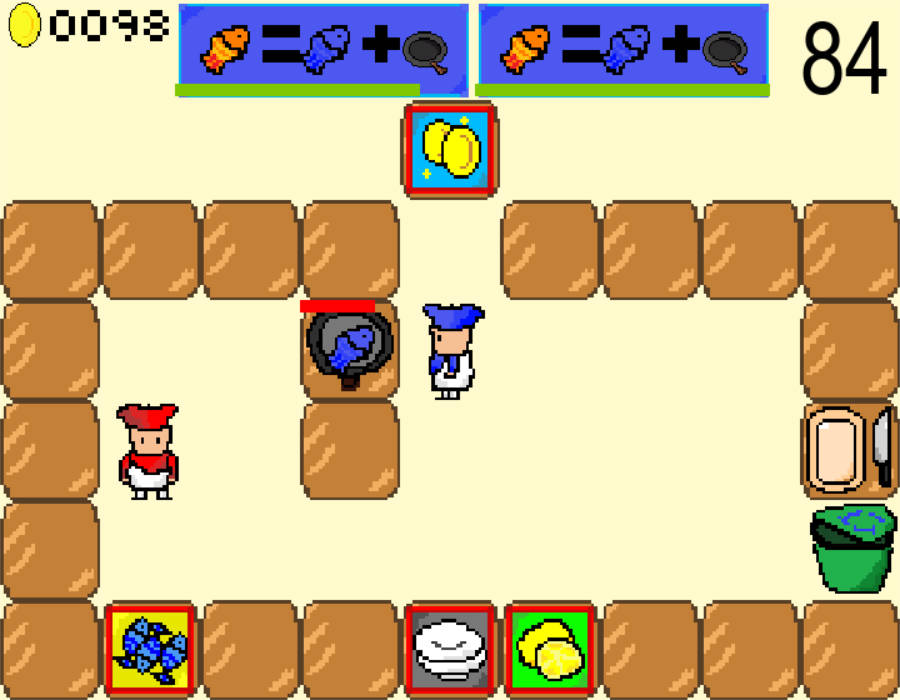

# 分手厨房-pygame

[中文](/readme.ch.md)|[English](/readme.md)

### 简介🤸‍♂️：

-----

嗨👋，目前的开源的分手厨房项目是基于前后端编写的h5游戏，因为只会python，考察了一下pygame，发现写这样一个游戏很简单，并且可以更加还原游戏原本的一些环境，更加适合python同学，以下是游戏场景：



### 特性👦

----

- 原版游戏不同菜品的合成，如  切好的 柠檬+ 煎好的 鱼+盘子=香煎精鱼，牛肉+番茄+汉堡胚+盘子=牛肉汉堡！
- 菜单滚动条倒计时，支持用户自己定义，增加图片和合成菜谱即可
- 还原切菜动作，切菜时不可移动，移动则暂停切菜
- 垃圾桶
- 支持用户定义游戏场景

### 安装🚗

---

你可以克隆本项目

```git
git clone https://github.com/hlonely98/overcook_pygame.git
```

## 代码结构

todo

