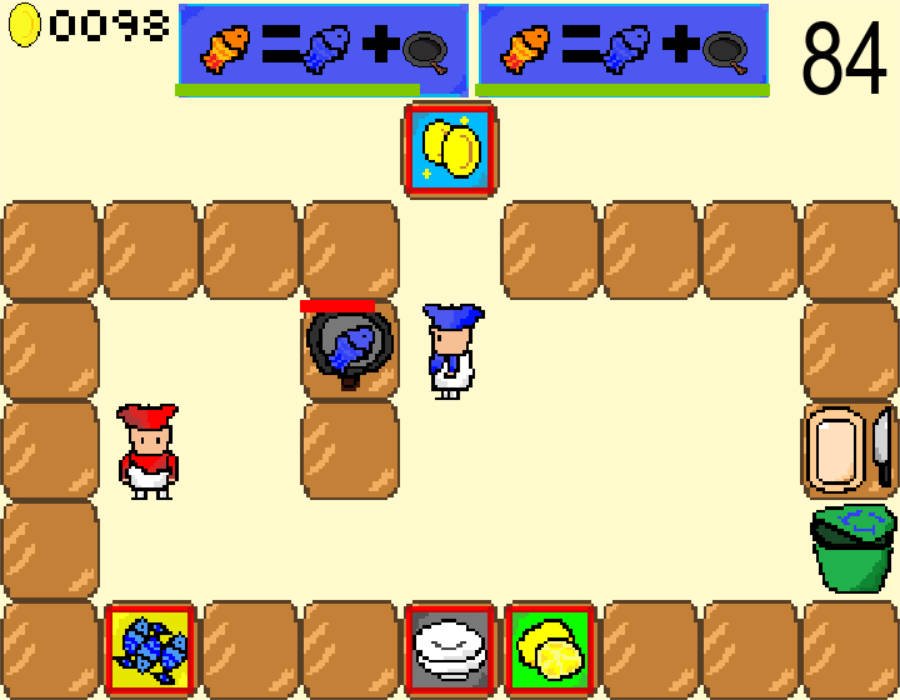

# overcook_pygame

[中文](readme.ch.md)|[English](readme.md)

### Introduction 🤸‍♂️:

-----

Hi there 👋, the current open-source project "overcook" is an h5 game based on front-end and back-end development. As I only know Python, I looked into Pygame and found it very easy to write such a game, and it also allows a better restoration of some of the original game environments, making it more suitable for Python students. Here's a glimpse of the game scene:



### Features 👦

----

- Combination of different dishes in the original game, such as cut lemon + fried fish + plate = pan-fried fish
- Countdown timer for the menu scroll bar, which can be customized by users by adding images and recipe combinations
- Restoration of the chopping action, where movement during chopping will pause the action
- Trash can
- Support for user-defined game scenes

### Installation 🚗

---

You can clone this project by running:

```git
git clone https://github.com/hlonely98/overcook_pygame.git
```

## Code Structure

Todo